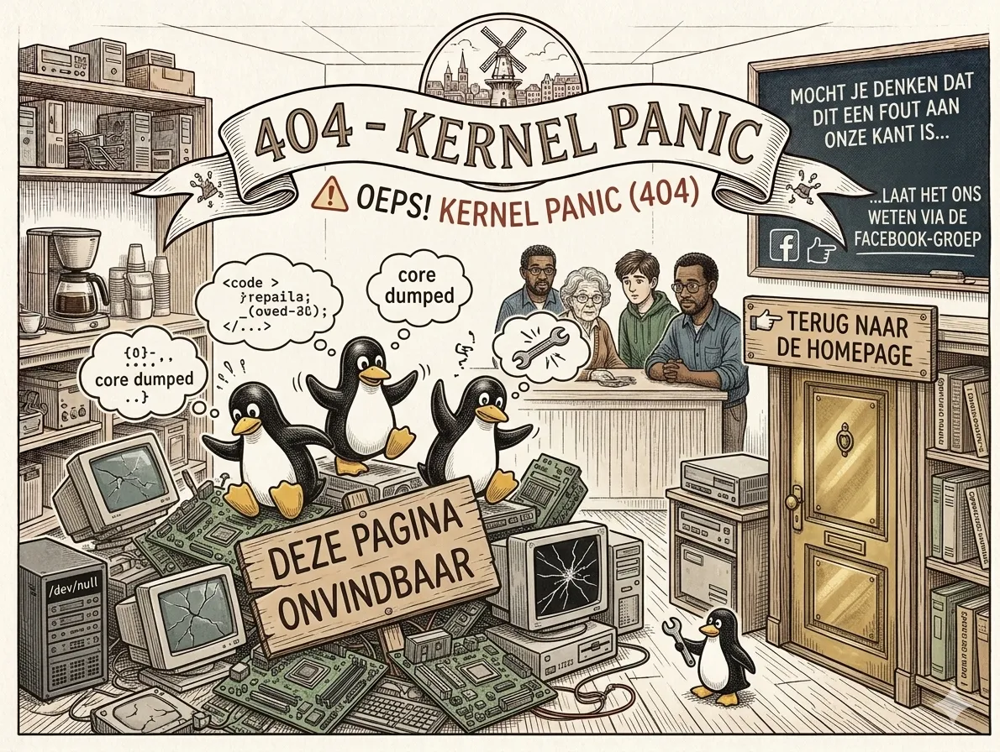

# ⚠️ Oeps! Kernel Panic (404)

Het lijkt erop dat we een **segmentation fault** hebben bereikt. De pagina die je zoekt is onvindbaar, verplaatst naar `/dev/null`, of nooit gecompileerd.

### Wat is er aan de hand?
* De link waar je op klikte is verouderd.
* Er zit een typefout in de URL.
* De pinguïns zijn nog aan het werk aan dit onderdeel.

---

### Geen paniek!
Je hoeft je systeem niet te rebooten. Je kunt eenvoudig terugkeren naar de bewoonde wereld:

👉 [**Terug naar de Homepage**](/)

---

*Mocht je denken dat dit een fout aan onze kant is, laat het ons dan even weten via de [Facebook-groep](https://www.facebook.com/groups/linuxcafehaarlem/).*

> © 2026 **Stichting Linux Kennis Computer Centrum** | KvK: 82063214 | SBI 94993 | RSIN: 862322431 |  [ANBI-status](https://st-lkcc.nl/blog/2025/05/17/bestuurlijke-stukken-stichting-linux-kennis-computer-centrum/)