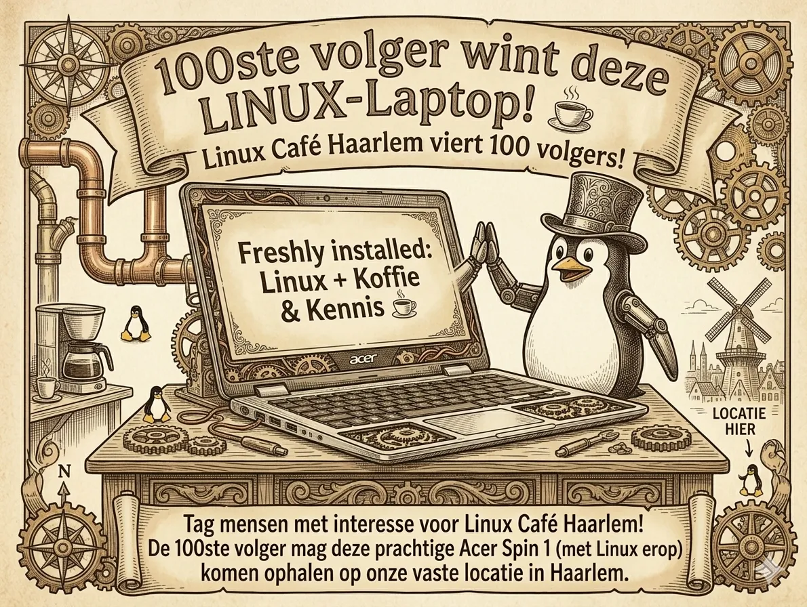

# Welkom bij Linux Café Haarlem 🐧
**De plek waar code en koffie samenkomen.**

Heb jij nog een oude laptop of desktop computer ergens in huis liggen? Krijg je geen ondersteuning meer van Microsoft, Apple of Google? Gooi hem niet weg! Met Linux op je hardware kun je gewoon weer verder. 

Zelf gebruik ik hardware van ruim 10 jaar oud en het draait weer als een treintje. Het leuke is... dat kun jij ook!

### Wat kun je verwachten?
* **Samen leren & bouwen:** We werken in kleine groepjes (max. 4 personen) voor persoonlijke aandacht.
* **Hulp bij installatie:** Nog geen Linux? Geen probleem, wij helpen je stap voor stap.
* **Duurzaamheid:** Geef je computer een tweede kans. Het is beter voor je portemonnee én het milieu.
* **Gezelligheid:** Geen vaste lessen of verplicht niveau—iedereen helpt elkaar op zijn of haar eigen tempo.

---

## 🎁 Winactie: De 100ste volger wint!
We vieren onze groei! De 100ste volger van onze Facebook-groep wint een **Acer Spin 1** laptop, volledig klaargestoomd met Linux.

👉 [**Sluit je aan op Facebook**](https://www.facebook.com/groups/linuxcafehaarlem/)

---

### Volgende bijeenkomst:
📍 **Locatie:** Het Open Huis Haarlem  
🕙 **Tijd:** vrijdag van 10:00 tot 12:00 uur  
👥 **Toegang:** Gratis voor iedereen!

> © 2024 **Stichting [Naam]** | KvK: 12345678 | RSIN: 987654321 | [Privacyverklaring] | [ANBI-status]

