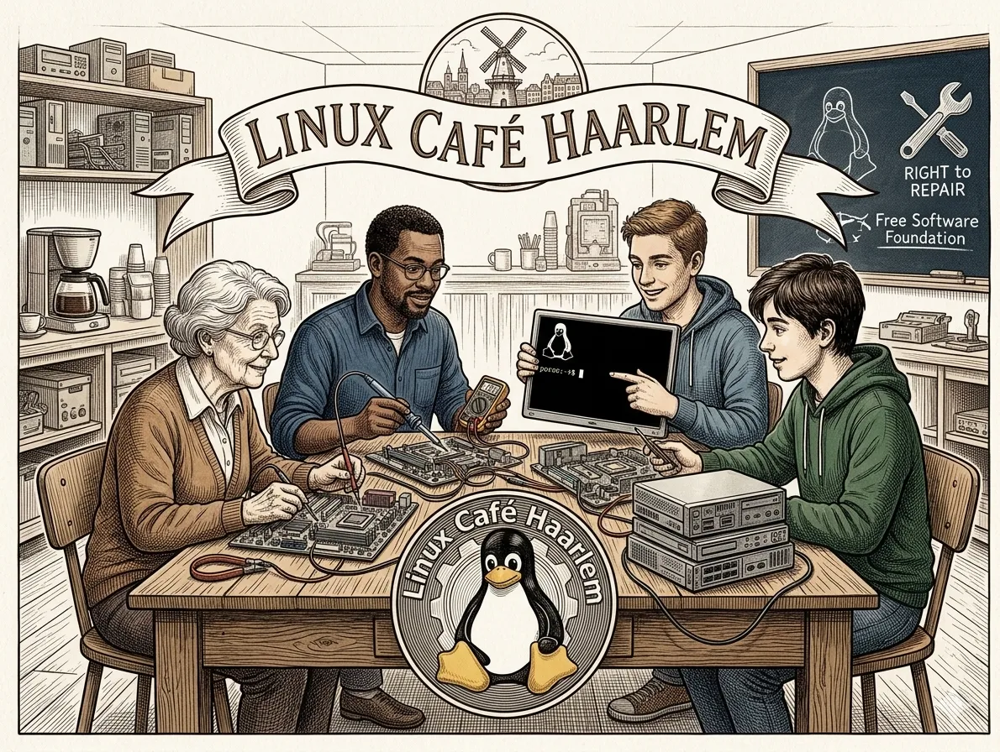

# Over ons

## Linux Café Haarlem – Samen leren, bouwen en gezelligheid

Linux Café Haarlem is een kleinschalige en gezellige groep tech-liefhebbers en beginners in de Muggenstad. Voor ons is Linux meer dan alleen een besturingssysteem; het staat voor vrijheid, samenwerking, hergebruik en slim omgaan met technologie.

We vinden het leuk om kennis te delen, samen te leren en elkaar te helpen. Daarbij staat laagdrempeligheid voorop: iedereen mag meedoen, ongeacht ervaring of achtergrond.

## Voor wie is het?

Voor iedereen! Ook mensen zonder technische achtergrond kunnen prima met Linux werken. Mijn moeder van 80 jaar en mijn schoonmoeder van 73 jaar gebruiken het bijvoorbeeld ook. Het lijkt in de praktijk vaak veel op wat je al gewend bent, en het is absoluut niet moeilijk om mee te beginnen.

Of je nu een doorgewinterde sysadmin bent, graag sleutelt aan hardware of gewoon nieuwsgierig bent naar een alternatief voor Windows of macOS: je bent van harte welkom.

## Onze doelen

Wij willen voorkomen dat goede hardware onnodig op de schroothoop belandt. Door Linux te installeren, geven we oude computers een tweede leven: sneller, veiliger en vaak nog jarenlang bruikbaar.

Daarmee helpen we niet alleen elkaar, maar dragen we ook bij aan een duurzamere omgang met techniek. Minder verspilling, meer hergebruik en meer waarde uit bestaande hardware — dat is waar we voor staan.

## Practice what you preach

Wat we anderen aanraden, doen we zelf ook. LinuxCaféHaarlem draait namelijk op een oude mini-pc van meer dan 10 jaar oud. Daarnaast gebruiken we zelf ook oude laptops voor ons werk en onze activiteiten.

Dat vinden we belangrijk, want het laat zien dat je met bewuste keuzes en een beetje creativiteit nog steeds een prima en betrouwbare omgeving kunt opbouwen. Zo maken we niet alleen een verhaal over hergebruik, maar leven we het ook echt na.

## the Free Software Foundation 

De [FSF](https://www.fsf.org/) staat stevig achter de Right to Repair-beweging, en daar sluiten wij ons bij aan. Ook Linux Café Haarlem gelooft in het recht om apparaten te repareren, te hergebruiken en zo lang mogelijk in gebruik te houden.

# Over Stichting Linux Kennis Computer Centrum

De website linuxcafehaarlem.nl is een officieel initiatief van **Stichting Linux Kennis Computer Centrum**. Op deze pagina leggen we uit wie we zijn, wat ons drijft en hoe onze organisatie is ingericht.

---

## Onze Missie & Visie
*Wat willen we bereiken en waarom?*

**Missie:**
Het hoofddoel van de stichting is het bevorderen van digitale participatie en veiligheid voor minderbedeelden, MKB met een ANBI-taak en digitaal kwetsbare personen. Dit doet zij door herbruikbare IT-apparatuur in te zamelen, te voorzien van een veilig Linux-besturingssysteem en kosteloos uit te leveren. Daarnaast leidt de stichting vrijwilligers en stagiaires op om digitale vaardigheden en bewustwording over internetveiligheid breed te verspreiden.

**Visie:**
Een samenleving waarin iedereen – ongeacht inkomen of digitale achtergrond – toegang heeft tot veilige, werkende IT-apparatuur en daardoor volwaardig kan meedoen aan het digitale verkeer. Oude computers en elektronica worden niet langer weggegooid, maar hergebruikt en gerecycled, wat leidt tot minder e-waste en een kleinere ecologische voetafdruk. Vrijwilligers en stagiaires helpen buurthuizen, kwetsbare groepen en kleine ondernemers om digitaal weerbaar en zelfredzaam te zijn.

---

## De Stichting
Stichting Linux Kennis Computer Centrum is opgericht op 2 maart 2021 en is gevestigd te Hellevoetsluis. Wij zijn een non-profit organisatie, wat betekent dat wij geen winstoogmerk hebben. Alle inkomsten en donaties worden direct ingezet om onze statutaire doelstellingen te verwezenlijken.

### Bestuurssamenstelling
Conform onze statuten en de normen voor goed bestuur, wordt de stichting geleid door een onbezoldigd [bestuur](https://st-lkcc.nl/over-ons/).

*Het bestuur is verantwoordelijk voor het strategisch beleid en de financiële gezondheid van de stichting.*

---

## Beloningsbeleid
Het beloningsbeleid is te vinden op [de transparantiepagina](transparantie.md).

---

## Documenten & Transparantie
Als stichting hechten wij veel waarde aan openheid. Onze meest recente jaarverslagen en beleidsplannen zijn te vinden op [de transparantiepagina](transparantie.md).

---

> **Vragen over onze organisatie?**
> Neem gerust contact op met ons secretariaat via geertvanos61@gmail.com .

## Samen verder

We hopen met Linux Café Haarlem een plek te zijn waar techniek toegankelijk blijft, waar oude hardware niet wordt afgeschreven, en waar mensen elkaar vinden in kennis, hulp en gezelligheid.

Samen leren, samen bouwen en samen laten zien dat oud nog lang niet af is.

---

[Cookie Beleid (EU)](https://st-lkcc.nl/cookiebeleid-eu/)

> © 2026 **Stichting Linux Kennis Computer Centrum** | KvK: 82063214 | SBI 94993 | RSIN: 862322431 |  [ANBI-status](https://st-lkcc.nl/blog/2025/05/17/bestuurlijke-stukken-stichting-linux-kennis-computer-centrum/)
