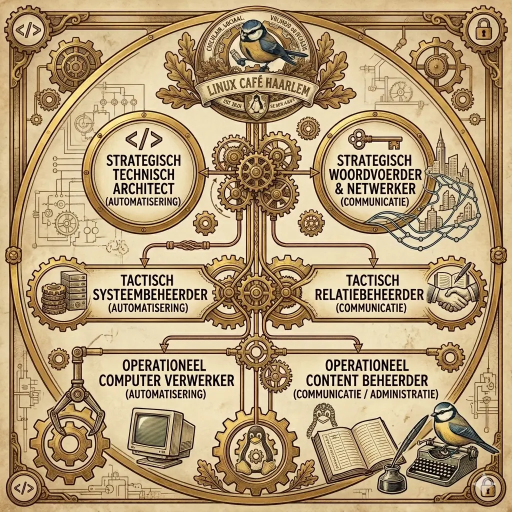

---
sitemap:
    lastmod: '20-05-2026 14:47'
---

# Vacatures: Bouw mee aan de digitale toekomst van Haarlem ♻️💻☕🐧

Welkom bij het Linux Café Haarlem. Wij geloven dat technologie toegankelijk, duurzaam en in eigen beheer moet zijn. In een tijd waarin digitale afhankelijkheid groeit, zetten wij ons in voor **Digital Sovereignty** (digitale soevereiniteit) en een circulaire economie.

### Waarom meedoen?
Bij Linux Café Haarlem draait het niet om het verkopen van producten, maar om het creëren van waarde voor de Haarlemse gemeenschap. Door gedoneerde hardware een tweede leven te geven met vrije en open-source software, maken we technologie inclusief en duurzaam. 

Wanneer je bij ons instapt, werk je aan:
- **Maatschappelijke impact:** Je helpt studenten en buurtgenoten aan betrouwbare apparatuur.
- **Circulariteit:** Je voorkomt e-waste door hardware vakkundig te repareren en hergebruiken.
- **Kennisdeling:** Je leert werken met de nieuwste automatiseringstechnieken (zoals Ansible en Netboot) in een professionele, maar informele setting.

Wij zoeken mensen die niet alleen willen "gebruiken", maar ook willen "bouwen". Of je nu een hands-on aanpakker bent, een communicatietalent, of een technische architect: bij ons leg je de fundamenten voor een eerlijker digitaal landschap.

Klaar om jouw steentje bij te dragen? Bekijk hieronder onze openstaande rollen en ontdek waar jouw kracht het beste tot zijn recht komt.

[TOC]

## Vacature 1: OPERATIONEEL COMPUTER VERWERKER (AUTOMATISERING)
- **Status:** Open
- **Type rol:** Stagiair / Vrijwilliger 
- **Tijdsbesteding:** 4-8 uur per week
- **Locatie:**  Technische Locatie, Haarlem 
### Profiel

Verantwoordelijk voor de fysieke verwerking van gedoneerde apparatuur. Zorgt dat elke laptop volgens de gestelde standaard klaargemaakt wordt voor gebruik.

### Taken

DOELSTELLING

VERANTWOORDELIJKHEDEN
- Fysieke inspectie en reiniging van binnenkomende hardware.
- Uitvoeren van het 'Happy Path' installatieprotocol:
  1. Aansluiten op netwerk.
  2. Booten via Netboot.xyz.
  3. Starten van het toegewezen Ansible script.
- Controleren of het proces succesvol is afgerond (checklist).
- Signaleren van hardware-defecten (afwijkingen direct apart leggen voor de Systeembeheerder).

INPUT
- 'Happy Path' protocollen en checklists van de Tactisch Systeembeheerder.

OUTPUT
- Gebruiksklare laptops die voldoen aan de technische standaard.
- Geregistreerde hardware-status in het voorraadbeheer.

GEWENSTE COMPETENTIES
- Praktisch en secuur: houdt van fysiek werk en het afwerken van checklists.
- Discipline: volgt het protocol strikt en probeert niet zelf te 'sleutelen' aan de backend.
- Oog voor detail: merkt fysieke gebreken aan apparatuur tijdig op.

Kernprincipe: Meters maken op basis van een vast protocol; kwaliteit door consistentie.

## Vacature 2: OPERATIONEEL CONTENT BEHEERDER (COMMUNICATIE / ADMINISTRATIE)
- **Status:** Open
- **Type rol:** Stagiair / Vrijwilliger 
- **Tijdsbesteding:** 4-8 uur per week
- **Locatie:** Het Open Huis, Haarlem
### Profiel
Verantwoordelijk voor de zichtbaarheid en administratieve afhandeling van het project. Zorgt dat alle communicatie verloopt volgens de 
afgesproken templates en planning.

### Taken

DOELSTELLING

VERANTWOORDELIJKHEDEN
- Up-to-date houden van de website (evenementen, nieuws).
- Onderhouden van social media kanalen op basis van de contentkalender.
- Verwerken van e-mailverkeer (beantwoorden van vragen/donaties) middels vaste templates.
- Bijhouden van de administratie (ledenbestand, afspraken, subsidie-logboek).

INPUT
- Contentkalender en templates van de Tactisch Relatiebeheerder.
- Vaste workflows voor administratieve taken.

OUTPUT
- Actieve en actuele online kanalen.
- Een georganiseerde mailbox en administratieve dossiers.
- Tijdige communicatie naar partners en donateurs.

GEWENSTE COMPETENTIES
- Secuur en gestructureerd: werkt altijd volgens de geldende templates en protocollen.
- Betrouwbaar: beantwoordt e-mails en updates binnen de gestelde termijnen.
- Digital native: handig met website-CMS, e-mailclients en social media tools.

Kernprincipe: Consistente communicatie via vastgelegde templates; ontzorgt de organisatie door administratieve flow.

## Vacature 3: TACTISCH SYSTEEMBEHEERDER (AUTOMATISERING)
- **Status:** Open
- **Type rol:** Vrijwilliger 
- **Tijdsbesteding:** 4-8 uur per week
- **Locatie:** Technische Locatie, Haarlem

### Profiel
Verantwoordelijk voor de stabiliteit en betrouwbaarheid van de 
technische infrastructuur. Vertaalt de strategische eisen naar 
onderhoudbare Ansible-playbooks en Netboot.xyz-configuraties.

### Taken

VERANTWOORDELIJKHEDEN
- Onderhoud van de 'Happy Path' infrastructuur voor de uitvoerders.
- Versiebeheer van playbooks en Netboot-configs (Github).
- Kwaliteitsbewaking: zorgt dat automatisering foutloos draait op de aangeleverde hardware.
- Eerstelijns troubleshooting: lost complexe technische blokkades op waar de uitvoerder niet uitkomt.

INPUT
- Strategische richtlijnen van de Architect (bijv. nieuwe software-eisen of hardware-standaarden).

OUTPUT
- Stabiele, reproduceerbare installatieomgevingen.
- Duidelijke werkinstructies voor de Operationeel Automatisering.

GEWENSTE COMPETENTIES
- Praktische ervaring of sterke affiniteit met Ansible en deployment omgevingen.
- Procesmatig denkvermogen: kan complexe taken versimpelen tot een 'hufterproof' protocol.
- Systeemdenken: begrijpt hoe wijzigingen in de configuratie invloed hebben op de fysieke operatie.

Kernprincipe: Bouwt de gereedschapskist; laat de uitvoerders het werk doen.

## Vacature 4: TACTISCH RELATIEBEHEERDER (COMMUNICATIE)
- **Status:** Open
- **Type rol:** Vrijwilliger 
- **Tijdsbesteding:** 4-8 uur per week
- **Locatie:** Het Open Huis, Haarlem

### Profiel
Verantwoordelijk voor de externe positionering en de duurzaamheid 
van het project. Vertaalt de strategische visie naar een concrete 
communicatie-roadmap en beheert de relaties met partners en gemeente.
### Taken

VERANTWOORDELIJKHEDEN
- Ontwikkeling van de contentstrategie en bewaking van de 'tone-of-voice'.
- Opstellen en bijhouden van subsidie-aanvragen en verantwoordingen.
- Onderhouden van contacten met de Gemeente Haarlem, scholen en andere maatschappelijke partners.
- Vertalen van strategische doelen naar actielijsten voor de Operationeel Communicatie.

INPUT
- Strategische prioriteiten van de Architect (bijv. focus op circulaire initiatieven of fondsenwerving).

OUTPUT
- Goedgekeurde contentplannen, succesvolle subsidieaanvragen en een actieve netwerkagenda.
- Duidelijke instructies en templates voor de Operationeel Communicatie.

GEWENSTE COMPETENTIES
- Organisatorisch sterk: kan complexe netwerken en planningen beheren.
- Communicatief vaardig: kan de visie van Linux Café Haarlem vertalen naar verschillende doelgroepen.
- Administratieve drive: vindt voldoening in het borgen van afspraken en het behalen van mijlpalen.

Kernprincipe: Bouwt de brug naar de buitenwereld; faciliteert groei en continuïteit.

## Vacature 5: STRATEGISCH WOORDVOERDER & NETWERKER
**Status:** Open
**Type rol:** Vrijwilliger 
**Tijdsbesteding:** 4-8 uur per week
**Locatie:** Het Open Huis, Haarlem

### Profiel

Het gezicht en de stem van Linux Café Haarlem. Deze persoon 
vertaalt jouw technische architectuur naar maatschappelijke 
waarde en zorgt dat de stichting wordt gezien, gehoord en 
financieel ondersteund.

### Taken

VERANTWOORDELIJKHEDEN
- Netwerker: Gebruikt zijn/haar netwerk in Haarlem om partners, 
  sponsors en donateurs aan boord te krijgen.
- Woordvoerder: Treedt op als aanspreekpunt voor media, 
  gemeente en zakelijke relaties.
- "Deur-opener": Krijgt dingen voor elkaar door mensen 
  enthousiast te maken voor de visie (Digital Sovereignty & Circulariteit).
- Strategisch klankbord: Denkt met jou mee over de koers van de 
  stichting, maar laat de 'T-kant' (techniek) aan jou over.

INPUT
- Jouw strategische architectuur en technische visie.

OUTPUT
- Een vol netwerk, een stroom aan middelen/donaties en een 
  sterke maatschappelijke positie in Haarlem.

GEWENSTE COMPETENTIES
- Charismatisch en sociaal behendig: kan de taal spreken van 
  zowel een wethouder als een directeur van een bedrijf.
- Resultaatgericht netwerker: geniet van het verbinden van 
  mensen en het sluiten van deals.
- Loyaliteit aan de missie: begrijpt dat het achterliggende 
  technische systeem de basis is voor het maatschappelijke succes.

Kernprincipe: "Jij bouwt de motor, zij zijn de ambassadeur die de reis verkoopt en brandstof regelt."

---
### Interesse om mee te bouwen?
Ben je enthousiast geworden over een van deze rollen? Stuur een korte motivatie naar **haarlem@st-lkcc.nl**. We maken graag kennis onder het genot van een kop koffie in Het Open Huis om te kijken hoe jouw talenten en onze ambities samenkomen.

---

[Cookie Beleid (EU)](https://st-lkcc.nl/cookiebeleid-eu/)

> © 2026 **Stichting Linux Kennis Computer Centrum** | KvK: 82063214 | SBI 94993 | RSIN: 862322431 |  [ANBI-status](https://st-lkcc.nl/blog/2025/05/17/bestuurlijke-stukken-stichting-linux-kennis-computer-centrum/)