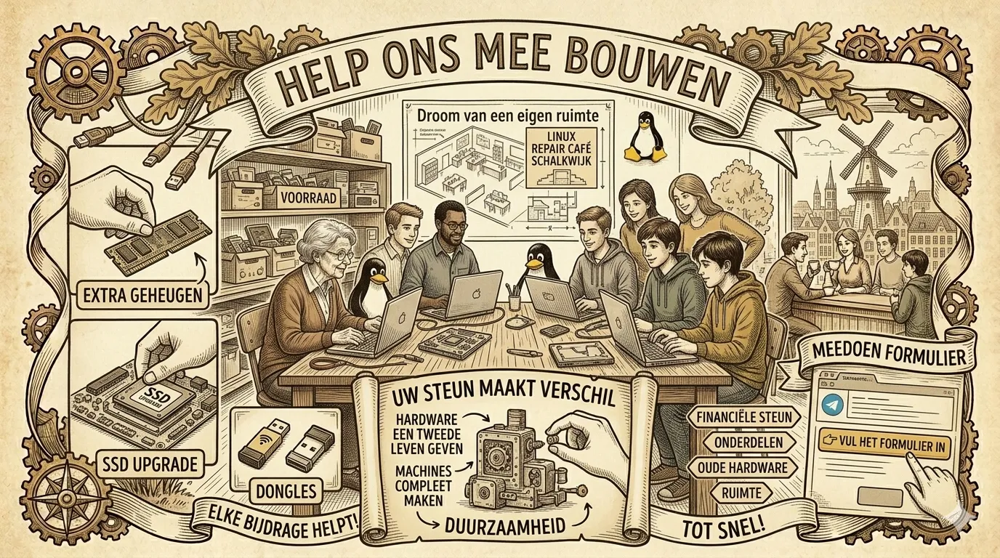

---
sitemap:
    lastmod: '20-05-2026 14:45'
---

# Help ons mee bouwen

Soms is er maar een kleine upgrade nodig, zoals een SSD, wat extra geheugen, een wifi-dongle of een bluetooth-dongle, om een machine echt goed te laten werken.

Daarvoor zijn we soms afhankelijk van een sponsor. Op andere momenten bewaren we hardware eerst even op voorraad, totdat we alles bij elkaar hebben om er samen een mooie, goed werkende machine van te maken.

Daarnaast zijn we ook blij met donaties van oude hardware. Juist die onderdelen kunnen vaak nog heel waardevol zijn en een tweede leven krijgen in een nieuw geheel.

## Uw steun maakt verschil

Met uw hulp kunnen we:
- hardware een tweede leven geven;
- machines compleet en bruikbaar maken;
- ontbrekende onderdelen aanvullen;
- zorgen dat goede techniek niet onnodig stil blijft staan;
- oude hardware opnieuw inzetten waar dat mogelijk is.

## Een eigen ruimte in Schalkwijk

Een eigen ruimte in Schalkwijk zou helemaal geweldig zijn. Als een organisatie ons daarin kan faciliteren, kunnen we nog meer doen met het verzamelen, herstellen en samenstellen van werkende machines.

## Meedoen

Iedere bijdrage helpt, groot of klein. Of het nu gaat om financiële steun, onderdelen, oude hardware of een ruimte om in te werken: samen maken we er iets moois van.

Heeft u interesse om ons te steunen? Vul dan het [formulier](/contact) in en laat het ons weten — elke bijdrage maakt verschil.

---

[Cookie Beleid (EU)](https://st-lkcc.nl/cookiebeleid-eu/)

> © 2026 **Stichting Linux Kennis Computer Centrum** | KvK: 82063214 | SBI 94993 | RSIN: 862322431 |  [ANBI-status](https://st-lkcc.nl/blog/2025/05/17/bestuurlijke-stukken-stichting-linux-kennis-computer-centrum/)
