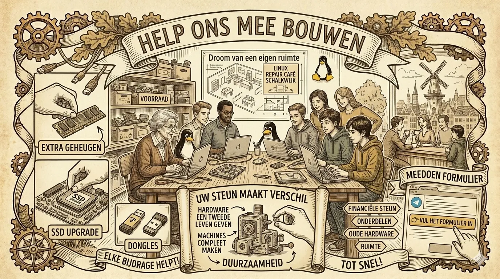

---
sitemap:
    lastmod: '25-05-2026 9:30'
---

# Sponsor Linux Café Haarlem
Soms is er maar een kleine upgrade nodig, zoals een SSD, extra geheugen of een wifi-dongle, om een machine echt goed te laten werken.

## Sponsors gezocht
Soms zijn we afhankelijk van een sponsor. Op andere momenten bewaren we hardware eerst op voorraad, totdat we alles bij elkaar hebben om er samen een mooie, goed werkende machine van te maken. Daarnaast zijn we blij met donaties van oude hardware; juist die onderdelen kunnen vaak nog heel waardevol zijn en een tweede leven krijgen in een nieuw geheel.

## Uw steun maakt verschil
Met uw hulp kunnen we:
- hardware een tweede leven geven;
- machines compleet en bruikbaar maken;
- ontbrekende onderdelen aanvullen;
- zorgen dat goede techniek niet onnodig stil blijft staan;
- oude hardware opnieuw inzetten waar dat mogelijk is.

## Wij zoeken een Technische Hub in Haarlem
Om onze missie verder uit te breiden, zoeken wij een vaste werkruimte in Haarlem (bij voorkeur in de omgeving van Schalkwijk). Een afsluitbare technische ruimte van minimaal 3 bij 3 meter zou voor ons een enorme sprong voorwaarts betekenen.

**Wat wij zoeken:**
- Een ruimte met elektriciteit en een stabiele ethernetverbinding naar het internet;
- Basisvoorzieningen zoals een bureau, stoel en kastruimte voor opslag;
- De ruimte zal fungeren als centraal punt voor bulk-installaties, software-ontwikkeling, hardware-testen en reparaties.

### Een oproep aan lokale bedrijven en organisaties:
Bent u een IT-bedrijf, makelaar, woningbouwvereniging of andere organisatie in Haarlem? Mogelijk beschikt u over een lege ruimte, kantoor of opslag die wij kunnen gebruiken. Uw facilitaire steun helpt ons direct om de circulaire economie in onze regio te versterken.

## Waarom steunen?
Elke bijdrage helpt, groot of klein. Of het nu gaat om financiële steun, onderdelen, oude hardware of een ruimte: samen maken we er iets moois van.

Samen werken aan impact
Wij geloven niet in een eenzijdige relatie. Wanneer u ons steunt, bieden wij u:
- **Meetbare MVO-impact:** Wij houden bij hoeveel hardware we een tweede leven geven, wat u kunt gebruiken voor uw eigen duurzaamheidsrapportage.
- **Naamsvermelding:** Uw logo op onze website als gewaardeerde partner.
- **Fiscaal voordeel:** Dankzij onze ANBI-status is uw gift fiscaal aftrekbaar.
- **Kennisdeling:** De mogelijkheid tot workshops of consultatie over open-source software en privacy voor uw organisatie.

## Meedoen?
Heeft u interesse om ons te steunen of kunt u ons helpen aan een geschikte ruimte? Mail naar [Linux Cafe Haarlem](mailto:haarlem@st-lkcc.nl) en laat het ons weten — elke bijdrage maakt verschil.

---

> Copyleft ↄ 2026 **Linux Cafe Haarlem**. Gelicenseerd onder [CC BY-SA 4.0](https://creativecommons.org/licenses/by-sa/4.0/deed.nl).
**Stichting Linux Kennis Computer Centrum** | KvK: 82063214 | SBI 94993 | RSIN: 862322431 |  [ANBI-status](https://st-lkcc.nl/blog/2025/05/17/bestuurlijke-stukken-stichting-linux-kennis-computer-centrum/)

[Cookie Beleid (EU)](https://st-lkcc.nl/cookiebeleid-eu/)
