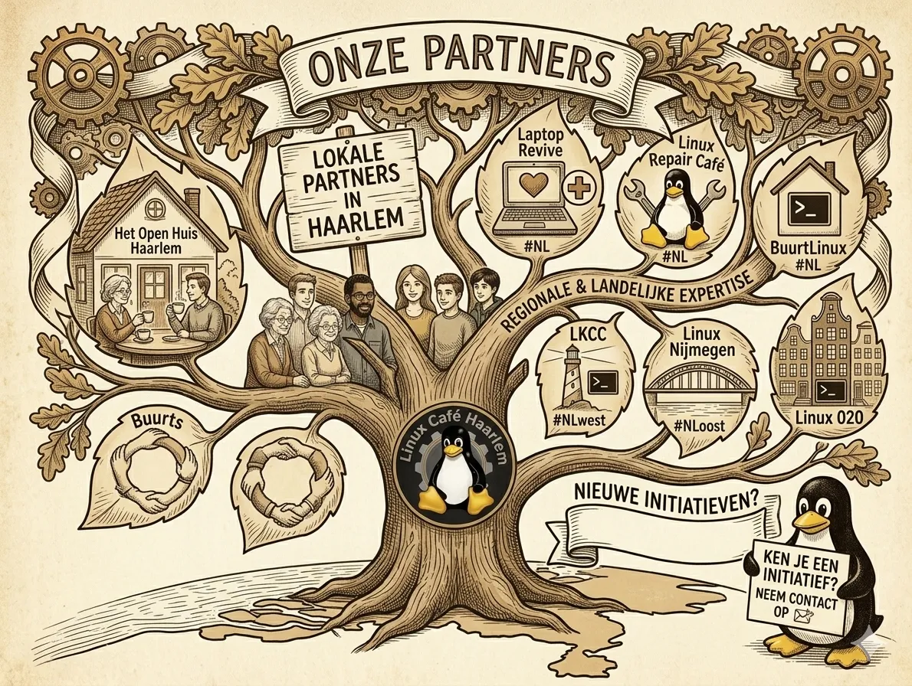

# Onze Partners

Bij **Linux Café Haarlem** geloven we in de kracht van de community. Samen met deze organisaties maken we ICT toegankelijk en duurzaam.

Linux Café Haarlem maakt onderdeel uit van [**Linux Kennis Computer Centrum (LKCC)**](https://st-lkcc.nl/) – Open Source ondersteuning in Voorne aan Zee, Nissewaard,  gebied Rijnmond en Haarlem.

## Lokale Partners in Haarlem

- [**Het Open Huis Haarlem**](https://hetopenhuishaarlem.nl/) – Onze gastvrije thuisbasis

- [**Buurts**](https://buurts.nl/) – Versterkt de sociale samenhang in de wijk

## Regionale & Landelijke Expertise

- [**Laptop Revive**](https://www.laptoprevive.nl/) – Geeft laptops een tweede leven #NL

- [**Linux Repair Café**](https://www.repaircafe.org/linux-repair-cafe/) – Hardware herstel met een open-source hart #NL

- [**BuurtLinux**](https://buurtlinux.nl/) – Linux hulp, direct in de buurt #NL

- [**Linux Nijmegen**](https://linuxnijmegen.nl/) – Onze bevriende community in Nijmegen #NLoost

- [**Linux 020**](https://linux020.nl/) – De Amsterdamse Linux-hub #NLwest

---

Wij zijn altijd op zoek naar andere Linux- en Open Source Software-activiteiten in het land om mee samen te werken. Ken je een initiatief of ben je er zelf bij betrokken? Neem dan gerust [contact met ons op](link-naar-contactpagina).

> © 2026 **Stichting Linux Kennis Computer Centrum** | KvK: 82063214 | SBI 94993 | RSIN: 862322431 |  [ANBI-status](https://st-lkcc.nl/blog/2025/05/17/bestuurlijke-stukken-stichting-linux-kennis-computer-centrum/)